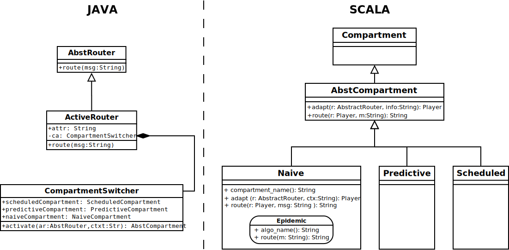

# Maven


### Scala + Eclipse
At some point I needed some Java code interact with Scala.
The build must be performed in a specific order (scala than java).
This might be doable with Eclipse; Lars show me how to do it with maven:

```
https://github.com/lschuetze/scroll-java-scala-interop
```

I used this example to extent to the routing-mock (code/scroll/router\_as\_player\_mock/pom.xml)




### Passing parameters to the JVM

MVN runs a JVM. 
If one needs to pass parameters to it, it should be not in the pom.xml file, but on the command line.

```
JAVA_HOME=“/Library/Java/JavaVirtualMachines/jdk1.8.0_111.jdk/Contents/Home” MAVEN_OPTS=“$MAVEN_OPTS -XX:+UnlockCommercialFeatures -XX:+FlightRecorder -XX:StartFlightRecording=duration=120s,delay=20s,settings=profile,filename=target/recording.jfr” mvn exec:java
```
