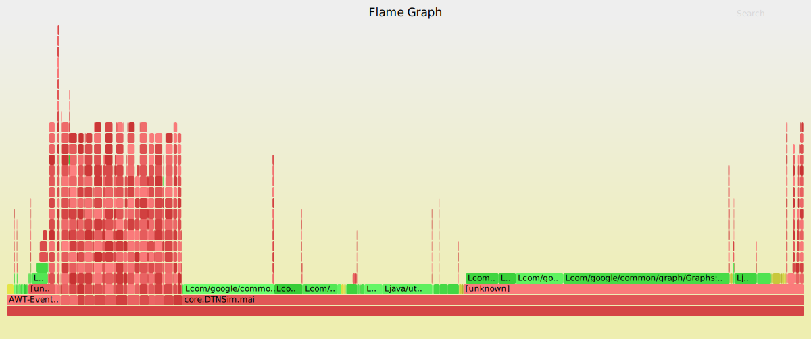

# Flamegraphs

### Need

```
https://github.com/brendangregg/FlameGraph.git
https://github.com/jvm-profiling-tools/perf-map-agent.git
```

1. Download FlameGraph
2. Download Perf-map-agent
3. Set variable with flamegraph directory 
4. Get the pid of the process to be profiled
5. Run. Example: FLAMEGRAPH\_DIR=/tmp/FlameGraph/ ./perf-java-flames  17407



# FlightRecording
Flight recorder is specific for Java application from Oracle.
https://docs.oracle.com/javacomponents/jmc-5-4/jfr-runtime-guide/about.htm#JFRUH170

It needs some flags to be passed to JVM in order to tell it to collect those metrics.
One use together with maven passing the parameters as follows:

JAVA\_HOME=“/Library/Java/JavaVirtualMachines/jdk1.8.0\_111.jdk/Contents/Home” MAVEN\_OPTS=“$MAVEN\_OPTS -XX:+UnlockCommercialFeatures -XX:+FlightRecorder -XX:StartFlightRecording=duration=120s,delay=20s,settings=profile,filename=target/recording.jfr” mvn exec:java
